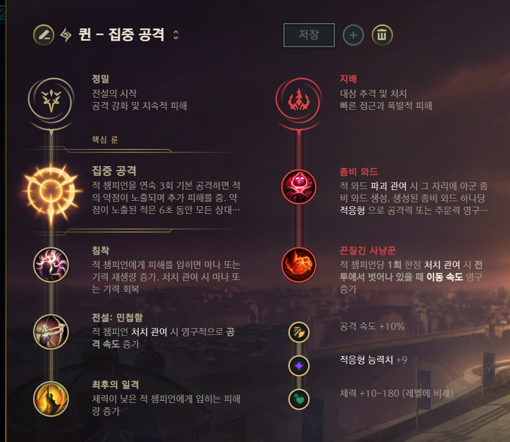
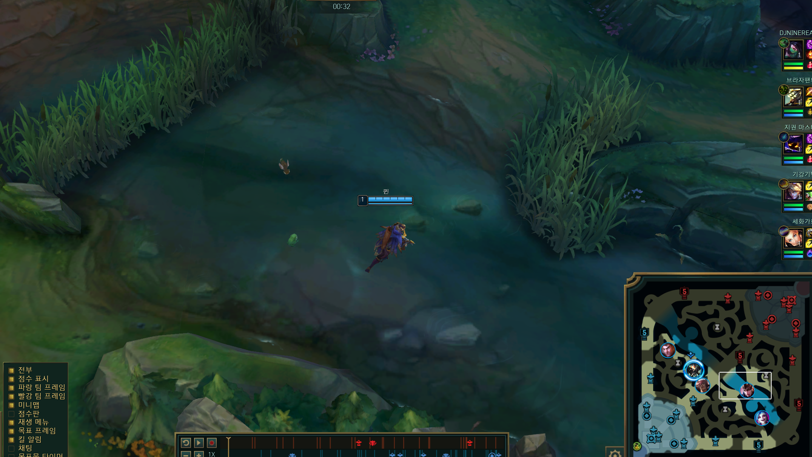
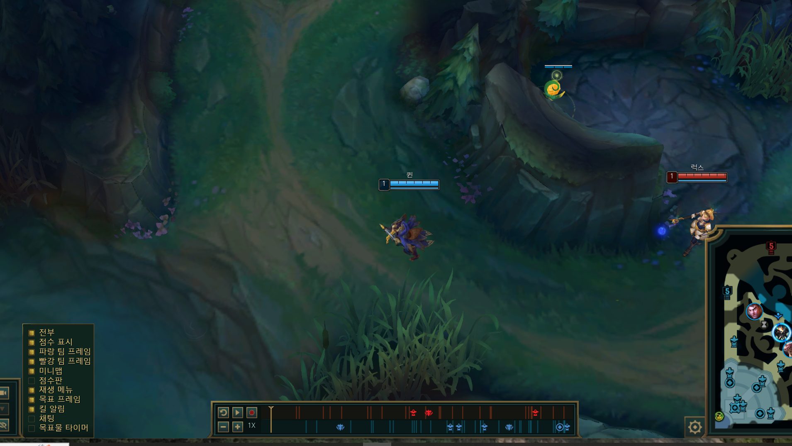

### 목차

- 롤 서폿 추천
- 룬 추천
- 스킬 콤보
- 라인전
- 승리로 이끄는 로밍 꿀팁
- 한타싸움에선

## 롤 서폿 추천

오늘 가지고 나온 서폿은 근거리 양학 챔프인 퀸입니다.

퀸은 탑으로 많이 사용하는데 서폿으로 사용한다고요? 약같지만 일반에서 검증된 퀸 서폿 한번 드셔보시죠.

최근 전적은 20전 14승 6패로 무난한 승률이 나오고 있구요.
가끔 야스오 요네, 세트같이 예능 픽들이 바텀에 오는 경우에 근거리 양학 챔프 다운 모습을 보여줍니다.

로밍을 좋아하신다면 퀸 서폿 강력 추천합니다.

룬부터 설명 갑니다.

## 룬 추천

집공과 감전에 대해서 고민했는데 감전도 쎄지만 지속적인 카이팅 및 아군이 때려도 피해를 줄 수 있는 집공이 라인전에 편했습니다.

퀸이 물리방관 템을 가기 때문에 마나 소모가 커서 침착을 들어주면 라인전에서 마나가 덜 부족하더라구요. 민첩함을 통해서 카이팅 속도를 올려주고 최후의 일격으로 딸피 챔프 킬을 따줍니다.

서폿이니까 좀비와드로 시야 밝혀주면 상대 움직임 파악에 좋습니다. 거기에 데미지까지 오르니 최고
끈사를 통해서 로밍이속을 올려줍니다.

## 템 추천

<첫번째 템>  
첫템은 신이속을 가서 경험치 손실을 최소화 하면서 치고 빠지기가 용이합니다.

<첫 코어템>  
퀸은 로밍이 필수이기 때문에 요오무를 통해서 빠른 이속으로 상대 라이너를 압박하여 팀원을 시팅하여 주면 됩니다.

특히 정글끼리 교전이 났을때 누가 더 빨리 지원가냐의 차이가 큰데 항상 정글이 바위게나 오브젝트 싸움을 하고 있으면 언제든 달려갈 준비를 해주면 교전을 크게 이기게 됩니다. 빠른 이속으로 상대 정글에 와드하나만 박아줘도 팀 기여도를 높일수 있습니다.

<두번째 코어템>
로밍후 첫 공격을 쎄게 만들어주는 벼락폭풍검을 2코어로 올리므로서 로밍에 힘을 주고 둔화로 인해서 우리팀이 딜을 넣을 수 있게 합니다.

내가 스킬을 잘 못피한다 싶으면 3코어정도에 밤끝을 가주데 웬만하면 딜로스 없게끔 무빙으로 피하자

<그 이후>  
3코어부턴 방관템 아무거나 가면 됩니다.

## 스킬 콤보

W - E - Q - W선마 - E선마
선 W 무조건 찍어줘서 맵을 밝히면 상대 인베방어나 상대 정글 블루나 레드에 와드박기 수월해서 W로 찍어줍니다.

상대가 노리쉬로 우리쪽 수풀에 숨어있는 경우도 갈때 W키고가면 안전하게 갈수 있습니다.

<라인전>  
상대가 들어오면 급하게 E 평 Q 평 해주면 되구요.
상대가 사거리가 긴 원거리 챔프여서 거리가 안나온다 싶으면 Q 평 E 평으로 상대 시야 가려주고 때립니다.

<로밍>  
R 평 E 평 Q 평으로 상대를 깜짝놀라게 해주면 반피가 닳아있습니다. Q는 상대 무빙 예측해서 쏴주는게 좋습니다.

로밍에 대해서 더 자세히 알아봅시다.

## 승리로 이끄는 로밍 꿀팁

- 6랩까진 로밍은 자제하고 바텀쪽에서 정글이 오브젝트를 먹고 있거나 교전이 일어난 경우, 상대 카정이 들어온 경우, 빠른 합류한다.

- **\<6랩 이후\>** 로밍 타이밍은 집으로 복귀후 바로 달리거나 라인을 밀고 원딜이 집을 곧 가는경우에 간다.
- 정글 오브젝트 싸움 >> 피가 없는 상대챔프 >> 라인이 당겨져 있는곳

- **\<서폿템 와드 이후\>** 바텀쪽 상대 정글 길목쪽에 와드
- 교전후 체력이 없으면 무리해서 로밍가지 말고 집가기, 어차피 빨라서 빨리 복귀가능
- 바텀 라인이 당겨져서 빅웨이브 쌓이면 다시 바텀쪽 합류하기, 우리정글이 없으면 최대한 버티되 무리하지 않기
- CC기가 있을때 무리하게 들어가면 물몸이기때문에 바로 녹으므로 R평Q평E평으로 E를 무리해서 쓰지 않기

## 한타싸움에선

싸움이 발생하기전엔 빠른 이속으로 들어갈까 말까 시늉만해도 상대 스킬을 뺴줄수 있는데 웬만하면 후진입한다. (한번 물리면 바로 죽기때문에)

여유 있을땐 사이드에서 혼자 미는 적을 빠르게 붙어서 킬을 따던가 빈 라인을 클리어한다.

싸움이 일어난 경우 원딜역할을 하기 때문에 절대 앞에 있지 말고 딸피인 애를 죽이고 빠지거나 뒤에서 카이팅만 해준다.

시즌 14 퀸 서폿 플레이해보시면 정말 재밌습니다. 즐겜하세요.
